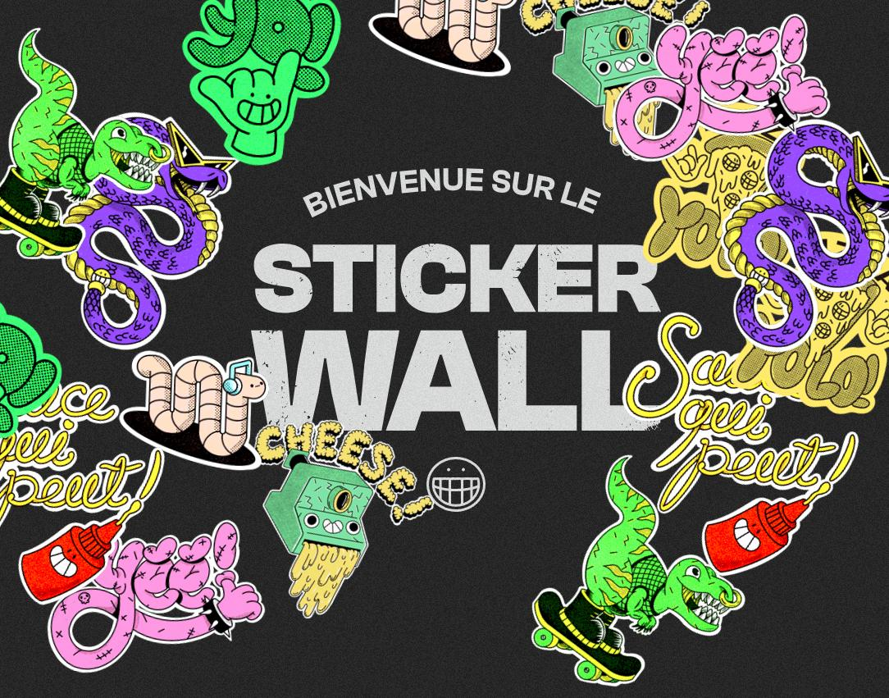

# 👽 WELCOME TO THE STICKER WALL 👽 

The sticker wall is pretty simple : click on the wall 🖱️, it will put a sticker on it 👾.

## Concept

- This actual version is just about it for now, a random sticker on that wall. 
- But hopefully, pretty soon, you will have choice on wich sticker you want to add on that wall.
- If new ideas of other functionalities comes up, i may be working on it to improve the wall.

## Recent updates

- The deck of stickers has been doubled : enjoy your 8 new sticker.
- You can take screenshots of your wall, and make a wallpaper of it for your device
- You can reset the wall, meaning remove all stickers at once if you want to
- UI improvements and quirkier style there and there

## Stack 🛠

This project has been the perfect exercise to strengthen my skills on :

- React
- TypeScript
- Framer Motion
- SASS
- Redux

## Enjoy, come & put a sticker the wall
